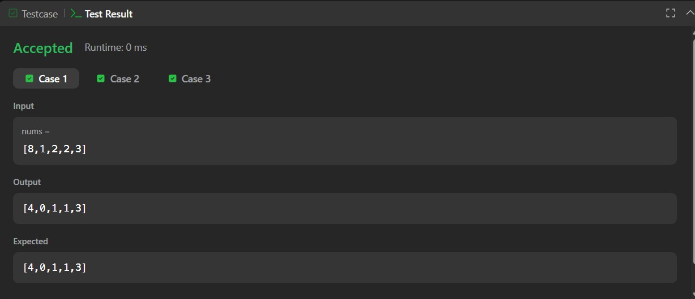
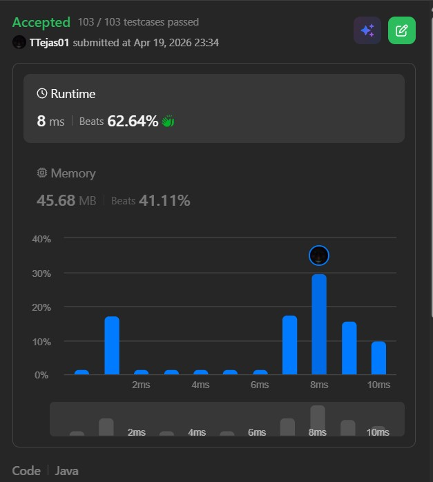

# 1365. How Many Numbers Are Smaller Than the Current Number – Java Solution

This repository contains a Java solution for the **LeetCode problem: How Many Numbers Are Smaller Than the Current Number**.

The solution demonstrates a **brute-force comparison approach** to count how many elements are smaller than each element in the array.

---

## 📌 Problem Overview

Given an integer array `nums`, for each element `nums[i]`, count how many numbers in the array are strictly smaller than it.

Return the result as an array.

---

## 🧪 Code Functionality

- Initializes a result array `counts`  
- For each element:
  - Iterates through the entire array  
  - Counts how many elements are smaller than the current element  
- Stores the count in the result array  
- Returns the final array  

---

## 🧠 Concepts Covered

- Arrays  
- Nested loops  
- Brute-force approach  
- Comparison logic  
- Time and Space Complexity analysis  

---

## ⏱️ Complexity Analysis

- **Time Complexity:** O(n²)  
- **Space Complexity:** O(n)

---

## 🖥️ Screenshots

📸 **Case:**  

📸 **Submit:**  

---

## 📂 File Information

- Solution.java — Java source code  
- case.jpg — Screenshot of Case (Run) output  
- submit.jpg — Screenshot of Submit result  
- README.md — Problem documentation  

---

## ⚠️ Notes

- Uses a brute-force approach with nested loops  
- Not optimal for large inputs  
- Helps in building fundamental understanding of comparison-based problems  

---

## 👨‍💻 Author

Tejas Halvankar  

- GitHub: https://github.com/Tejas-H01  
- LinkedIn: https://www.linkedin.com/in/your-linkedin-username  
- Email: tejashalvankar0@gmail.com