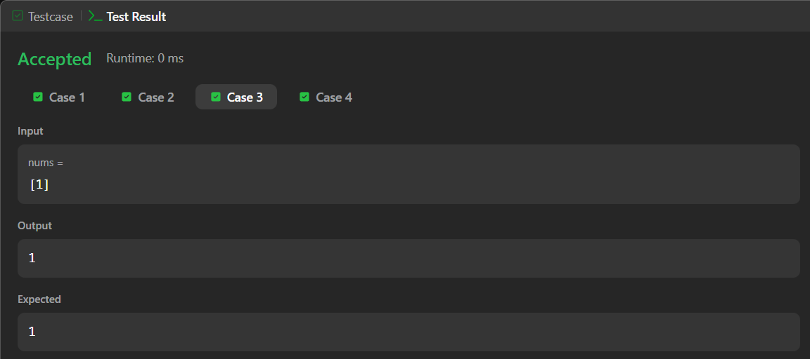
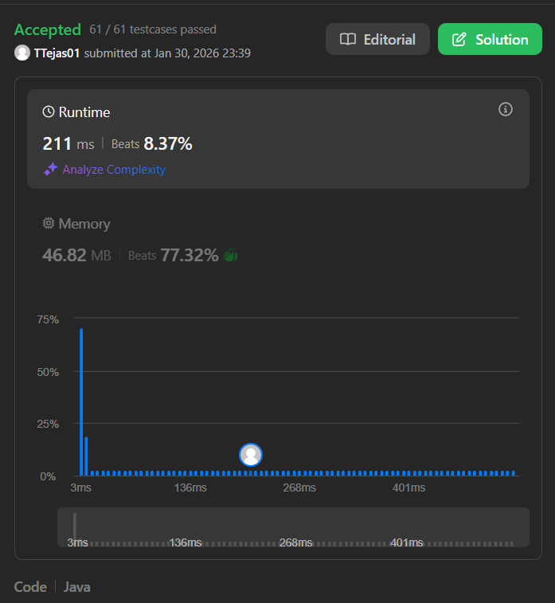

# 136. Single Number – Java Solution

This repository contains a Java solution for the **LeetCode problem: Single Number**.

The solution identifies the element that appears exactly once in the array while all other elements appear twice, using a **brute-force comparison approach**.

---

## 📌 Problem Overview

Given a non-empty integer array `nums`, every element appears twice except for one.  
Find and return the element that appears only once.

---

## 🧪 Code Functionality

- Initializes a variable to store the final answer  
- Handles the edge case where the array has only one element  
- Uses two nested loops to compare each element with all others  
- Skips comparison when both indices are the same  
- If an element does not match with any other element, it is identified as the single number  
- Returns the unique element immediately once found  

---

## 🧠 Concepts Covered

- Arrays  
- Nested loops  
- Conditional statements  
- Brute-force comparison  
- Early return optimization  

---

## ⏱️ Complexity Analysis

- **Time Complexity:** O(n²)  
- **Space Complexity:** O(1)

---

## 🖥️ Screenshots

📸 **Case:**  

📸 **Submit:**  

---

## 📂 File Information

- Solution.java — Java source code  
- case.png — Screenshot of Case (Run) output  
- submit.png — Screenshot of Submit result  
- README.md — Problem documentation  

---

## ⚠️ Notes

- Uses a brute-force approach for clarity  
- No extra data structures are used  
- Not the most optimal solution, but useful for understanding logic building  

---

## 👨‍💻 Author

Tejas Halvankar  

- GitHub: https://github.com/Tejas-H01  
- LinkedIn: https://www.linkedin.com/in/your-linkedin-username  
- Email: tejashalvankar0@gmail.com

