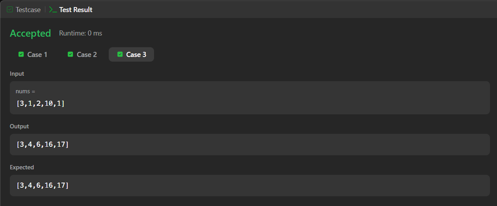
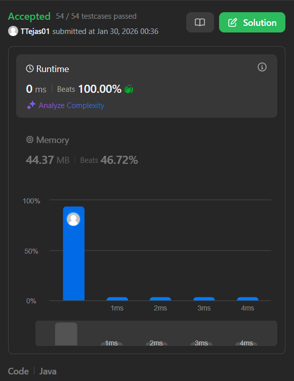

# 1480. Running Sum of 1D Array – Java Solution

This repository contains a Java solution for the **LeetCode problem: Running Sum of 1D Array**.

The solution demonstrates how to compute the cumulative sum of an array using an **in-place, single-pass approach** for optimal performance.

---

## 📌 Problem Overview

Given an integer array, each element at index `i` is updated to store the sum of all elements from index `0` to `i`.

This problem is commonly used to introduce **prefix sum concepts** and efficient array traversal techniques.

---

## 🧪 Code Functionality

- Traverses the array starting from the second element  
- Adds the previous element’s value to the current element  
- Modifies the array in place  
- Returns the updated array as the result  

---

## 🧠 Concepts Covered

- Arrays  
- Prefix Sum (Running Sum)  
- In-place array modification  
- Linear traversal  
- Time and Space Complexity optimization  

---

## ⏱️ Complexity Analysis

- **Time Complexity:** O(n)  
- **Space Complexity:** O(1) (in-place)

---

## 🖥️ Screenshots

📸 **Case:**  

📸 **Submit:**  

---

## 📂 File Information

- Solution.java — Java source code  
- case.png — Screenshot of Case (Run) output  
- submit.png — Screenshot of Submit result  
- README.md — Problem documentation  

---

## ⚠️ Notes

- The array is modified in place  
- No additional data structures are used  
- Suitable for interview and beginner DSA practice  

---

## 👨‍💻 Author

Tejas Halvankar  

- GitHub: https://github.com/Tejas-H01  
- LinkedIn: https://www.linkedin.com/in/your-linkedin-username  
- Email: tejashalvankar0@gmail.com
