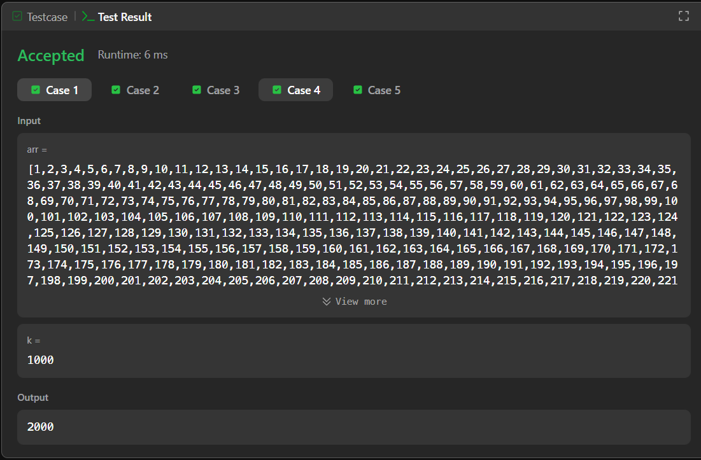

# LeetCode\Easy\Arrays\1539. Kth Missing Positive Number – Java Solution

This repository contains a Java solution for the **LeetCode problem: LeetCode\Easy\Arrays\1539. Kth Missing Positive Number**.

---

## 📌 Problem Overview

Given an input, the task is to compute the required result according to the problem constraints.

The problem focuses on applying basic algorithmic reasoning and efficient traversal to derive the solution.

---

## 🎯 Difficulty

Easy

---

## 🧪 Code Functionality

- Reads the input values  
- Iterates through the data structure  
- Applies the required logic step by step  
- Computes and returns the final result  

---

## 🧠 Concepts Covered

- Loops  
- Conditional statements  
- Basic algorithmic logic  
- Problem-solving patterns  

---

## ⏱️ Execution Time

1 hour 20 mins

---

## 🖥️ Screenshots

📸 **Test Case Result**

📸 **Submission Result**

---

## 📂 File Information

- `Solution.java`
- testcases.png
- submission.png
- README.md

---

## 👨‍💻 Author

Tejas Halvankar   
GitHub: https://github.com/Tejas-H01  
LinkedIn: www.linkedin.com/in/tejashalvankar
