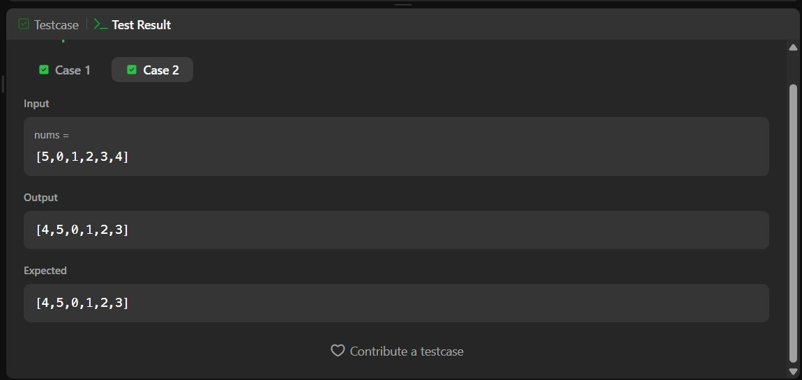

# 1920. Build Array from Permutation – Java Solution

This repository contains a Java solution for the **LeetCode problem: Build Array from Permutation**.

The solution demonstrates how to construct a new array using **index mapping based on permutation values**.

---

## 📌 Problem Overview

Given a zero-based permutation array `nums` of length `n`, build an array `ans` of the same length such that:

- `ans[i] = nums[nums[i]]`

A permutation means all elements are unique and range from `0` to `n-1`.

---

## 🧪 Code Functionality

- Creates a new array `ans` of size `n`  
- Iterates through the array  
- For each index `i`:
  - Uses the value at `nums[i]` as a new index  
  - Assigns `ans[i] = nums[nums[i]]`  
- Returns the constructed array  

---

## 🧠 Concepts Covered

- Arrays  
- Index mapping  
- Permutations  
- Indirect indexing  
- Time and Space Complexity analysis  

---

## ⏱️ Complexity Analysis

- **Time Complexity:** O(n)  
- **Space Complexity:** O(n)

---

## 🖥️ Screenshots

📸 **Case:**  

📸 **Submit:**  

---

## 📂 File Information

- Solution.java — Java source code  
- case.jpg — Screenshot of Case (Run) output  
- submit.jpg — Screenshot of Submit result  
- README.md — Problem documentation  

---

## ⚠️ Notes

- Uses an extra array for clarity and simplicity  
- Relies on the property that `nums` is a permutation  
- Common problem to understand **index-based transformations**  

---

## 👨‍💻 Author

Tejas Halvankar  

- GitHub: https://github.com/Tejas-H01  
- LinkedIn: https://www.linkedin.com/in/your-linkedin-username  
- Email: tejashalvankar0@gmail.com