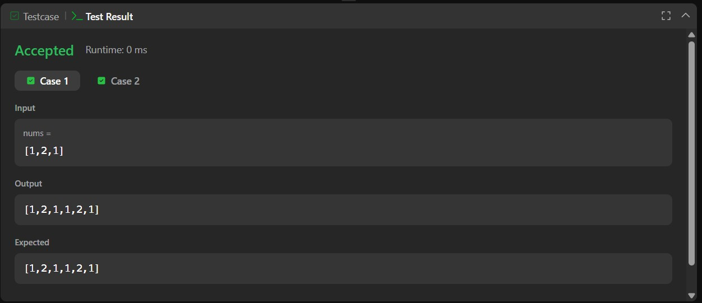
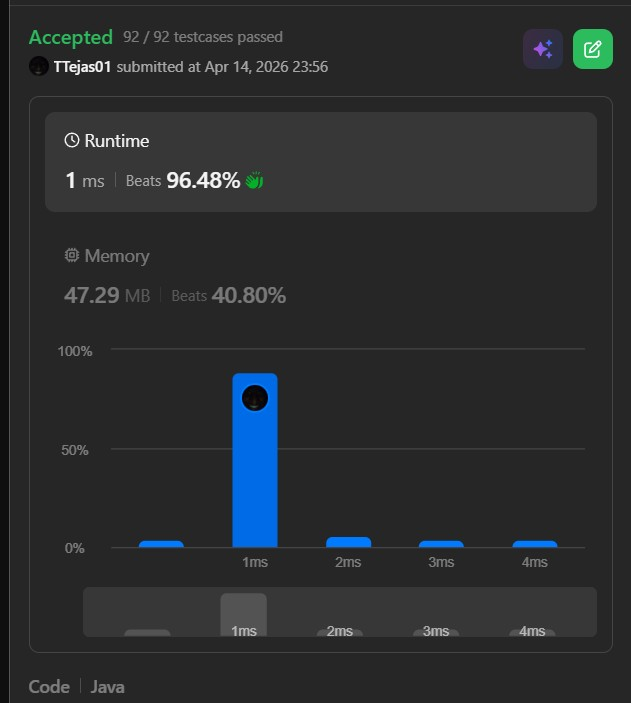

# 1929. Concatenation of Array – Java Solution

This repository contains a Java solution for the **LeetCode problem: Concatenation of Array**.

The solution demonstrates how to duplicate an array by creating a new array of double size and filling it efficiently using a **single-pass approach**.

---

## 📌 Problem Overview

Given an integer array `nums` of length `n`, return an array `ans` of length `2n` where:

- `ans[i] = nums[i]`
- `ans[i + n] = nums[i]`

This problem focuses on **array manipulation and indexing techniques**.

---

## 🧪 Code Functionality

- Creates a new array of size `2 * n`  
- Iterates through the original array once  
- Copies each element to:
  - Its original index  
  - Its corresponding index in the second half  
- Returns the concatenated array  

---

## 🧠 Concepts Covered

- Arrays  
- Index manipulation  
- Single-pass traversal  
- Memory allocation  
- Time and Space Complexity analysis  

---

## ⏱️ Complexity Analysis

- **Time Complexity:** O(n)  
- **Space Complexity:** O(n) (new array created)

---

## 🖥️ Screenshots

📸 **Case:**  

📸 **Submit:**  

---

## 📂 File Information

- Solution.java — Java source code  
- case.png — Screenshot of Case (Run) output  
- submit.png — Screenshot of Submit result  
- README.md — Problem documentation  

---

## ⚠️ Notes

- A new array is created, so space is not in-place  
- Efficient due to single traversal  
- Common beginner problem for understanding array duplication  

---

## 👨‍💻 Author

Tejas Halvankar  

- GitHub: https://github.com/Tejas-H01  
- LinkedIn: https://www.linkedin.com/in/your-linkedin-username  
- Email: tejashalvankar0@gmail.com