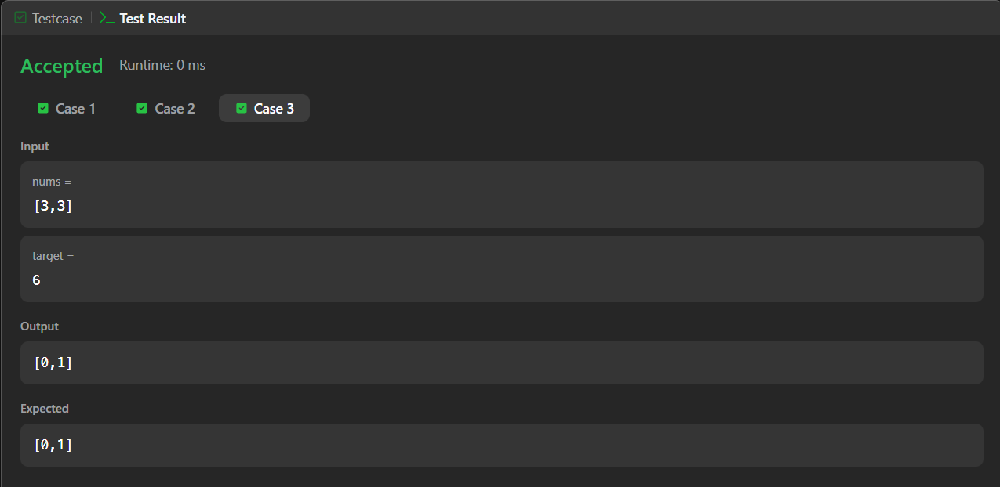
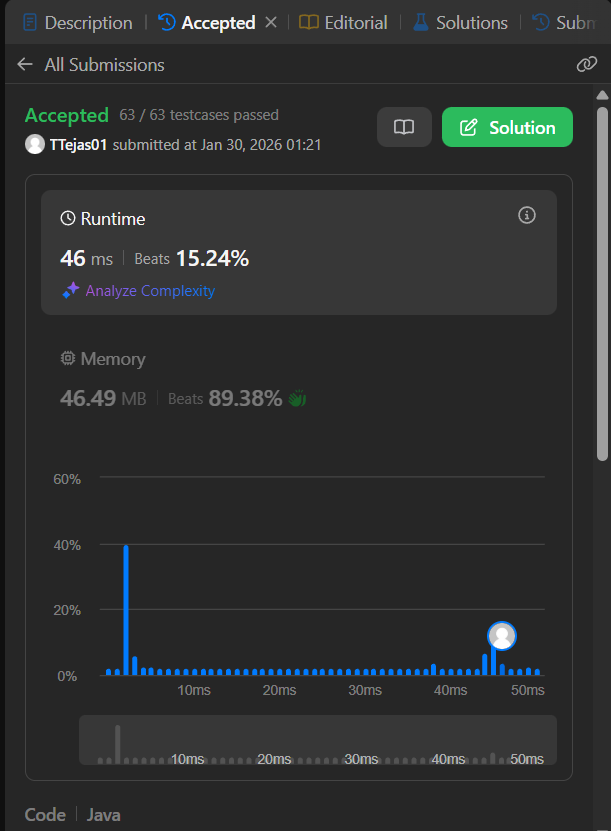

# 1. Two Sum – Java Solution

This repository contains a Java solution for the **LeetCode problem: Two Sum**.

The solution uses a **brute-force, nested-loop approach** to find two indices whose values add up to the target.

---

## 📌 Problem Overview

Given an integer array `nums` and an integer `target`, return the indices of the two numbers such that they add up to the target.

Each input has exactly one solution, and the same element cannot be used twice.

---

## 🧪 Code Functionality

- Uses two nested `for` loops to check all possible pairs  
- The outer loop selects the first element  
- The inner loop checks the remaining elements  
- If the sum of a pair equals the target, their indices are returned  
- If no valid pair is found, `{-1, -1}` is returned  

---

## 🧠 Concepts Covered

- Arrays  
- Nested loops  
- Conditional statements  
- Brute-force searching  

---

## ⏱️ Complexity Analysis

- **Time Complexity:** O(n²)  
- **Space Complexity:** O(1)

---

## 🖥️ Screenshots

📸 **Case:**  

📸 **Submit:**  

---

## 📂 File Information

- Solution.java — Java source code  
- case.png — Screenshot of Case (Run) output  
- submit.png — Screenshot of Submit result  
- README.md — Problem documentation  

---

## ⚠️ Notes

- Uses a brute-force approach for clarity  
- No additional data structures are used  
- Suitable for beginners learning array traversal and logic building  

---

## 👨‍💻 Author

Tejas Halvankar  

- GitHub: https://github.com/Tejas-H01  
- LinkedIn: https://www.linkedin.com/in/your-linkedin-username  
- Email: tejashalvankar0@gmail.com
