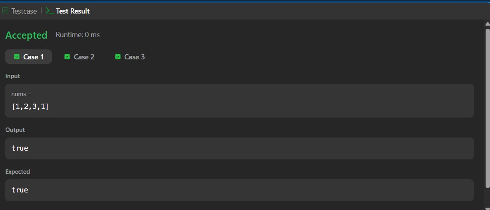
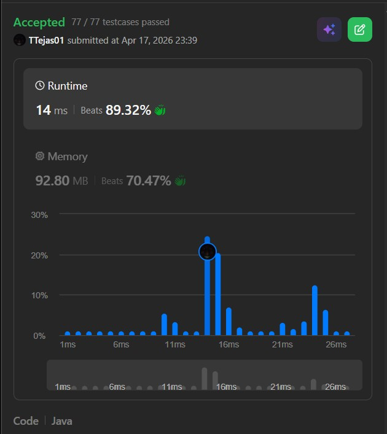

# 217. Contains Duplicate – Java Solution

This repository contains a Java solution for the **LeetCode problem: Contains Duplicate**.

The solution demonstrates how to efficiently detect duplicates in an array using a **HashSet for constant-time lookup**.

---

## 📌 Problem Overview

Given an integer array `nums`, return `true` if any value appears at least twice in the array, and return `false` if every element is distinct.

This problem focuses on **efficient searching and duplicate detection**.

---

## 🧪 Code Functionality

- Initializes a `HashSet` to store unique elements  
- Iterates through the array  
- For each element:
  - Checks if it already exists in the set  
  - If yes → duplicate found → return `true`  
  - Otherwise → adds it to the set  
- Returns `false` if no duplicates are found  

---

## 🧠 Concepts Covered

- Arrays  
- HashSet  
- Duplicate detection  
- Efficient lookup (O(1) average)  
- Time and Space Complexity analysis  

---

## ⏱️ Complexity Analysis

- **Time Complexity:** O(n)  
- **Space Complexity:** O(n) (HashSet storage)

---

## 🖥️ Screenshots

📸 **Case:**  

📸 **Submit:**  

---

## 📂 File Information

- Solution.java — Java source code  
- case.jpg — Screenshot of Case (Run) output  
- submit.jpg — Screenshot of Submit result  
- README.md — Problem documentation  

---

## ⚠️ Notes

- Uses extra space for faster lookup  
- Avoids nested loops (which would be O(n²))  
- Standard optimal approach for duplicate detection problems  

---

## 👨‍💻 Author

Tejas Halvankar  

- GitHub: https://github.com/Tejas-H01  
- LinkedIn: https://www.linkedin.com/in/your-linkedin-username  
- Email: tejashalvankar0@gmail.com