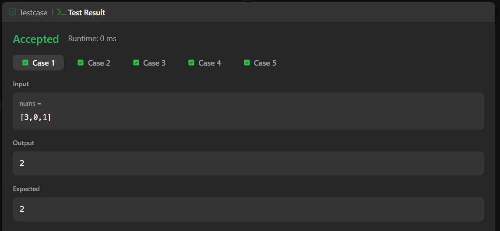

# 268. Missing Number – Java Solution

This repository contains a Java solution for the **LeetCode problem: Missing Number**.

The solution determines the missing number from a given range using a **custom iterative comparison approach** without using extra data structures.

---

## 📌 Problem Overview

Given an array `nums` containing `n` distinct numbers taken from the range `[0, n]`,  
return the only number in the range that is missing from the array.

---

## 🧪 Code Functionality

- Initializes a variable `missNo` starting from `0`  
- Iterates through the array to check whether `missNo` exists  
- If `missNo` is found in the array, it is incremented  
- The loop restarts to recheck from the beginning  
- Continues until a value of `missNo` is not found in the array  
- Returns the missing number  

---

## 🧠 Concepts Covered

- Arrays  
- Loop manipulation  
- Conditional logic  
- Brute-force searching  
- Variable reinitialization  

---

## ⏱️ Complexity Analysis

- **Time Complexity:** O(n²)  
- **Space Complexity:** O(1)

---

## 🖥️ Screenshots

📸 **Case:**  

📸 **Submit:**  

---

## 📂 File Information

- Solution.java — Java source code  
- case.png — Screenshot of Case (Run) output  
- submit.png — Screenshot of Submit result  
- README.md — Problem documentation  

---

## ⚠️ Notes

- Uses a brute-force style approach for simplicity  
- No additional data structures are used  
- Logic prioritizes understanding over optimal performance  

---

## 👨‍💻 Author

Tejas Halvankar  

- GitHub: https://github.com/Tejas-H01  
- LinkedIn: https://www.linkedin.com/in/your-linkedin-username  
- Email: tejashalvankar0@gmail.com

