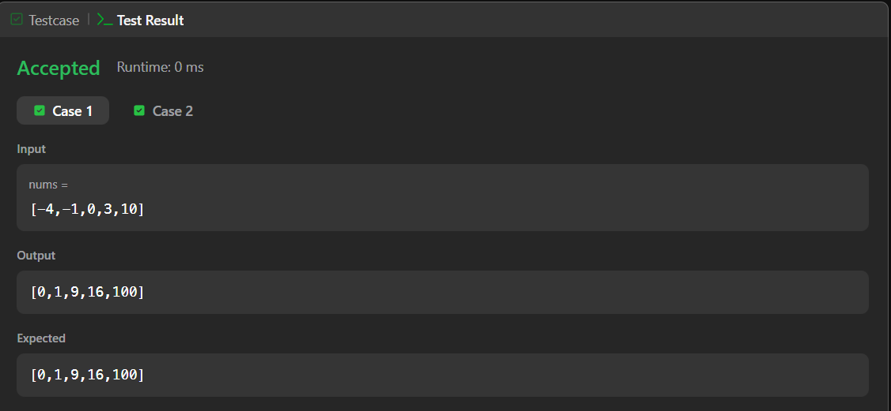
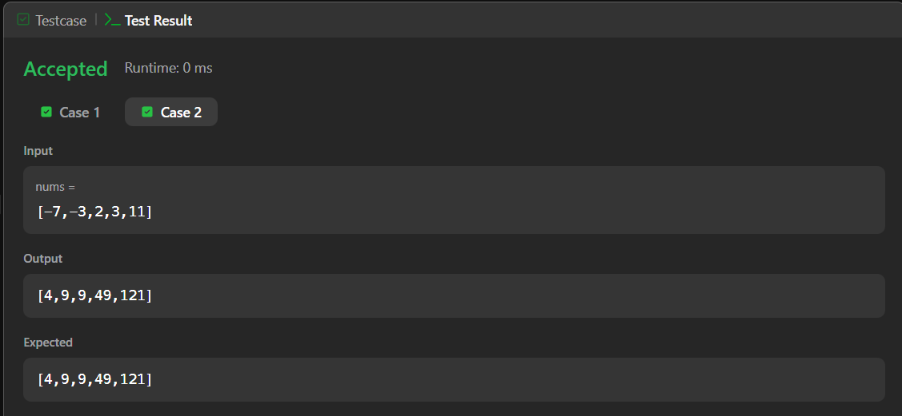
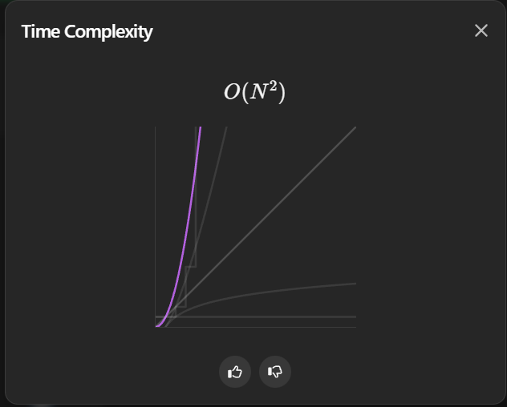

# 977. Squares of a Sorted Array – Java Solution

This repository contains a Java solution for the **LeetCode problem: Squares of a Sorted Array**.

The solution first squares each element of the array and then sorts the resulting values using a simple comparison-based approach.

---

## 📌 Problem Overview

Given an integer array `nums` sorted in non-decreasing order,  
return an array of the squares of each number, also sorted in non-decreasing order.

---

## 🧪 Code Functionality

- Traverses the array and replaces each element with its square  
- Uses a nested loop to sort the squared elements in ascending order  
- Swaps elements whenever an out-of-order pair is found  
- Returns the final sorted squared array  

---

## 🧠 Concepts Covered

- Arrays  
- Looping constructs  
- Nested loops  
- Arithmetic operations  
- Comparison-based sorting  

---

## 🖥️ Screenshots

📸 **Case 1:**  

📸 **Case 2:**  

📸 **Submit:**  

---

## ⏱️ Complexity Analysis

- **Time Complexity:** O(n²)  
- **Space Complexity:** O(1)

📸 **Complexity Proof:**  

---

## 📂 File Information

- Solution.java — Java source code  
- case1.png — Screenshot of Case 1 output  
- case2.png — Screenshot of Case 2 output   
- submit.png — Screenshot of Submit result  
- complex.png — Screenshot of time complexity analysis  
- README.md — Problem documentation  

---

## ⚠️ Notes

- Uses a simple sorting approach for clarity  
- No additional data structures are used  
- Not the most optimal solution, but easy to understand for beginners  

---

## 👨‍💻 Author

Tejas Halvankar  

- GitHub: https://github.com/Tejas-H01  
- LinkedIn: https://www.linkedin.com/in/your-linkedin-username  
- Email: tejashalvankar0@gmail.com
