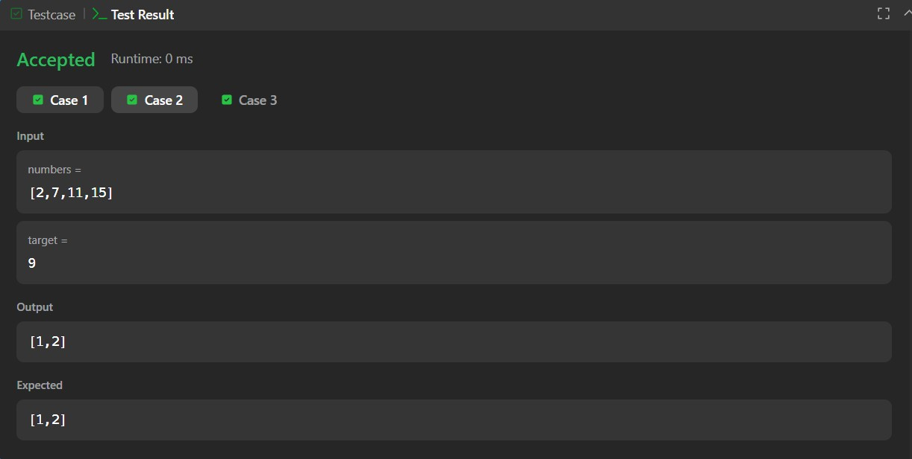
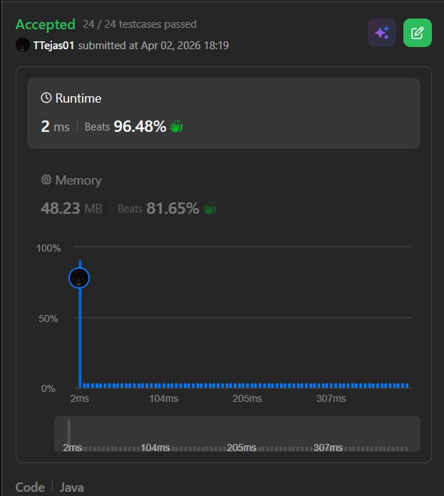

# 167. Two Sum II – Input Array Is Sorted – Java Solution

This repository contains a Java solution for the **LeetCode problem: Two Sum II – Input Array Is Sorted**.

The solution uses a **two-pointer approach** to efficiently find two numbers that add up to the target.

---

## 📌 Problem Overview

Given a 1-indexed array of integers `numbers` that is sorted in non-decreasing order,  
find two numbers such that they add up to a specific target number.

Return the indices of the two numbers (1-based indexing).

---

## 🧪 Code Functionality

- Initializes two pointers: `left` at the start and `right` at the end  
- Checks the sum of elements at both pointers  
- If the sum equals the target, returns their indices (1-based)  
- If the sum is less than target, moves the left pointer forward  
- If the sum is greater than target, moves the right pointer backward  
- Continues until the pair is found  

---

## 🧠 Concepts Covered

- Arrays  
- Two-pointer technique  
- Conditional logic  
- Efficient searching  

---

## 🖥️ Screenshots

📸 **Case:**  

📸 **Submit:**  

---

## ⏱️ Complexity Analysis

- **Time Complexity:** O(n)  
- **Space Complexity:** O(1)

---

## 📂 File Information

- Solution.java — Java source code  
- case.jpg — Screenshot of Case output  
- submit.jpg — Screenshot of Submit result  
- README.md — Problem documentation  

---

## ⚠️ Notes

- Uses an optimized two-pointer approach  
- More efficient than brute-force (O(n²))  
- Suitable for sorted array problems  

---

## 👨‍💻 Author

Tejas Halvankar  

- GitHub: https://github.com/Tejas-H01  
- LinkedIn: https://www.linkedin.com/in/your-linkedin-username  
- Email: tejashalvankar0@gmail.com
