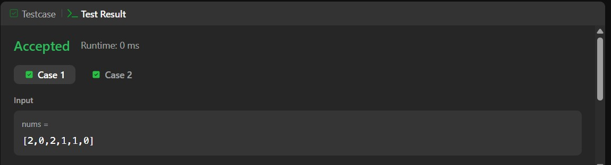

# 75. Sort Colors – Java Solution

This repository contains a Java solution for the **LeetCode problem: Sort Colors**.

The solution demonstrates a **comparison-based sorting approach (brute-force)** to sort an array containing only `0s`, `1s`, and `2s`.

---

## 📌 Problem Overview

Given an array `nums` with `n` objects colored red (`0`), white (`1`), and blue (`2`), sort them **in-place** so that objects of the same color are adjacent, with the order:

- `0 → 1 → 2`

---

## 🧪 Code Functionality

- Uses nested loops to compare elements  
- Swaps elements if they are in the wrong order  
- Gradually pushes smaller elements to the front  
- Sorts the array in ascending order (0 → 1 → 2)  
- Modifies the array **in place**  

---

## 🧠 Concepts Covered

- Arrays  
- Nested loops  
- Sorting (Selection/Bubble-like approach)  
- Swapping elements  
- In-place modification  
- Time and Space Complexity analysis  

---

## ⏱️ Complexity Analysis

- **Time Complexity:** O(n²)  
- **Space Complexity:** O(1)

---

## 🖥️ Screenshots

📸 **Case:**  

📸 **Submit:**  

---

## 📂 File Information

- Solution.java — Java source code  
- case.jpg — Screenshot of Case (Run) output  
- submit.jpg — Screenshot of Submit result  
- README.md — Problem documentation  

---

## ⚠️ Notes

- Works correctly but not optimal for large inputs  
- Uses a basic sorting technique (comparison-based)  
- Does not leverage the constraint of only 3 distinct values  

---

## 👨‍💻 Author

Tejas Halvankar  

- GitHub: https://github.com/Tejas-H01  
- LinkedIn: https://www.linkedin.com/in/your-linkedin-username  
- Email: tejashalvankar0@gmail.com